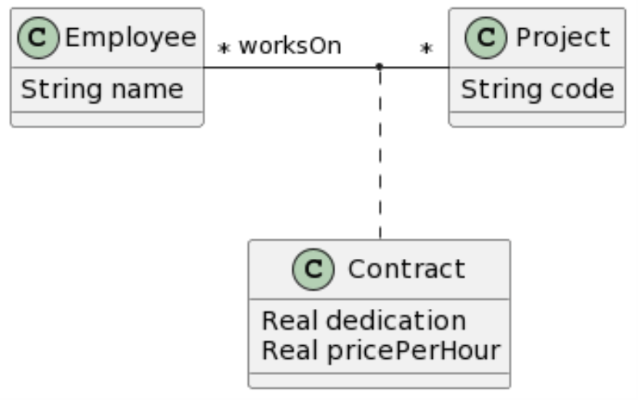

# Intent models

The models in this document represent different user *intents*, i.e., models that the user has in his mind and would like ChatGPT to generate. For each one the exercise consists in asking ChatGPT to produce the
corresponding UML model using one or more prompts.

The models are given by an image, and at most with some constraints written in OCL. We did not want to provide the USE or PlatUML specification so that ChatGPT does not learn from them. In this way, we can use them for testing future versions of ChatGPT.

All models are labeled with a series of tags indicating the modeling concepts and mechanisms covered by the model. 

Possible tags include: Enumerations, Classes, Attributes, Operations, Generalization, Association, Aggregation, Composition, Association Class, Multiple inheritance, Abstract classes, OCL constraints, Roles (as assoc. ends), Roles (as inherited classes), [Roles (as entity types)](https://link.springer.com/chapter/10.1007/978-3-540-30464-7_7), and [Materialization](http://www.vldb.org/conf/1994/P630.PDF) 
 

## Amphibious

<!---  -->

<p align="center">

</p>

```
constraints 
context LandVehicle inv LandMaxSpeed: 
    self.maxSpeed = 30
context LandVehicle inv LandEnvironment: 
    self.environment = #land
context MarineVehicle inv MarineMaxSpeed: 
    self.maxSpeed = 10
context MarineVehicle inv MarineEnvironment: 
    self.environment = #water
context AmphibiousVehicle  inv AmphibiousMaxSpeed: 
    self.maxSpeed = if self.environment = #water then 10 else 30 endif
context AmphibiousVehicle  inv AmphibiousEnvironment: 
    self.environment = #water or self.environment = #land
end
```

**Tags**: Enumerations, Classes, Attributes, Operations, Generalization, Association, Aggregation, Composition, Association Class, Multiple inheritance, Abstract classes, OCL constraints, Roles (as assoc. ends), Roles (as inherited classes), [Roles (as entity types)](https://link.springer.com/chapter/10.1007/978-3-540-30464-7_7), and [Materialization](http://www.vldb.org/conf/1994/P630.PDF). 


## Football Matches


<p align="center">

</p>


```
constraints
context League inv MatchesOK: -- matches must be between teams in the same league
  self.match->forAll(m|
    m.local.league->includes(self) and m.visitor.league->includes(self))
context Match inv DifferentTeams: self.local<>self.visitor
context Match inv LocalWinner: 
  self.finished and self.localGoals>self.visitorGoals 
    implies self.winner = self.local
context Match inv VisitorWinner: 
  self.finished and self.localGoals<self.visitorGoals 
    implies self.winner = self.visitor
context Match inv NoWinner: not self.finished or 
  (self.finished and self.localGoals=self.visitorGoals) 
    implies self.winner->isEmpty()
context Match inv GoalsOK: 
  self.localGoals>=0 and self.visitorGoals>=0
```
**Tags**: Enumerations, Classes, Attributes, Operations, Generalization, Association, Aggregation, Composition, Association Class, Multiple inheritance, Abstract classes, OCL constraints, Roles (as assoc. ends), Roles (as inherited classes), [Roles (as entity types)](https://link.springer.com/chapter/10.1007/978-3-540-30464-7_7), and [Materialization](http://www.vldb.org/conf/1994/P630.PDF). 

## Loans - Association Class

<p align="center">

</p>


```
constraints
context Customer inv OnlyOneLoan12Installments:
    self.loan->select(installments>12)->size()<=1
context Bank inv ThirtyPercentLoans12Installments:
    (self.loan->select(installments>12)->size() * 100.0 / self.loan->size()) <= 30
context Customer inv DifferentYears:
    self.loan->forAll(l1,l2|l1<>l2 implies l1.startingYear<>l2.startingYear)
```

**Tags**: Enumerations, Classes, Attributes, Operations, Generalization, Association, Aggregation, Composition, Association Class, Multiple inheritance, Abstract classes, OCL constraints, Roles (as assoc. ends), Roles (as inherited classes), [Roles (as entity types)](https://link.springer.com/chapter/10.1007/978-3-540-30464-7_7), and [Materialization](http://www.vldb.org/conf/1994/P630.PDF). 

## Loans - Class

<p align="center">

</p>


```
constraints
context Customer inv OnlyOneLoan12Installments:
    self.loan->select(installments>12)->size()<=1
context Bank inv ThirtyPercentLoans12Installments:
    (self.loan->select(installments>12)->size() * 100.0 / self.loan->size()) <= 30
context Customer inv DifferentYears:
    self.loan->forAll(l1,l2|l1<>l2 implies l1.startingYear<>l2.startingYear)
```

**Tags**: Enumerations, Classes, Attributes, Operations, Generalization, Association, Aggregation, Composition, Association Class, Multiple inheritance, Abstract classes, OCL constraints, Roles (as assoc. ends), Roles (as inherited classes), [Roles (as entity types)](https://link.springer.com/chapter/10.1007/978-3-540-30464-7_7), and [Materialization](http://www.vldb.org/conf/1994/P630.PDF). 


## School

<p align="center">

</p>

**Tags**: Enumerations, Classes, Attributes, Operations, Generalization, Association, Aggregation, Composition, Association Class, Multiple inheritance, Abstract classes, OCL constraints, Roles (as assoc. ends), Roles (as inherited classes), [Roles (as entity types)](https://link.springer.com/chapter/10.1007/978-3-540-30464-7_7), and [Materialization](http://www.vldb.org/conf/1994/P630.PDF). 

## Books and copies

<p align="center">

</p>

**Tags**: Enumerations, Classes, Attributes, Operations, Generalization, Association, Aggregation, Composition, Association Class, Multiple inheritance, Abstract classes, OCL constraints, Roles (as assoc. ends), Roles (as inherited classes), [Roles (as entity types)](https://link.springer.com/chapter/10.1007/978-3-540-30464-7_7), and [Materialization](http://www.vldb.org/conf/1994/P630.PDF). 


## Snarks

<p align="center">

</p>

**Tags**: Enumerations, Classes, Attributes, Operations, Generalization, Association, Aggregation, Composition, Association Class, Multiple inheritance, Abstract classes, OCL constraints, Roles (as assoc. ends), Roles (as inherited classes), [Roles (as entity types)](https://link.springer.com/chapter/10.1007/978-3-540-30464-7_7), and [Materialization](http://www.vldb.org/conf/1994/P630.PDF). 

## Car

<p align="center">

</p>

```
constraints
  context Model inv ModelUniqueNames: 
    Model.allInstances->isUnique(name)
  context Make inv MakeUniqueNames:   
    Make.allInstances->isUnique(name)
  context Model inv SameSeatSizes:
    self.car.seat->collect(size)->asSet()->size()=1
  context Car inv SameWheelDiameter:
    self.wheel->collect(diameter)->asSet()->size()=1
```

**Tags**: Enumerations, Classes, Attributes, Operations, Generalization, Association, Aggregation, Composition, Association Class, Multiple inheritance, Abstract classes, OCL constraints, Roles (as assoc. ends), Roles (as inherited classes), [Roles (as entity types)](https://link.springer.com/chapter/10.1007/978-3-540-30464-7_7), and [Materialization](http://www.vldb.org/conf/1994/P630.PDF). 

## PurchaseOrders

<p align="center">

</p>

```
constraints 
context Unit inv InStockOrWithCustomer:
   self.company->size() + self.order->size() = 1
```

**Tags**: Enumerations, Classes, Attributes, Operations, Generalization, Association, Aggregation, Composition, Association Class, Multiple inheritance, Abstract classes, OCL constraints, Roles (as assoc. ends), Roles (as inherited classes), [Roles (as entity types)](https://link.springer.com/chapter/10.1007/978-3-540-30464-7_7), and [Materialization](http://www.vldb.org/conf/1994/P630.PDF). 

## Banks

<p align="center">

</p>


```
constraints
  context Person inv ManagerOrClient:
    self.manager->notEmpty() implies 
    	   self.client.branch->excludes(self.manager.branch)
```

**Tags**: Enumerations, Classes, Attributes, Operations, Generalization, Association, Aggregation, Composition, Association Class, Multiple inheritance, Abstract classes, OCL constraints, Roles (as assoc. ends), Roles (as inherited classes), [Roles (as entity types)](https://link.springer.com/chapter/10.1007/978-3-540-30464-7_7), and [Materialization](http://www.vldb.org/conf/1994/P630.PDF). 

## Furniture

<p align="center">

</p>


**Tags**: Enumerations, Classes, Attributes, Operations, Generalization, Association, Aggregation, Composition, Association Class, Multiple inheritance, Abstract classes, OCL constraints, Roles (as assoc. ends), Roles (as inherited classes), [Roles (as entity types)](https://link.springer.com/chapter/10.1007/978-3-540-30464-7_7), and [Materialization](http://www.vldb.org/conf/1994/P630.PDF). 

## ScubaGear
<p align="center">

</p>


**Tags**: Enumerations, Classes, Attributes, Operations, Generalization, Association, Aggregation, Composition, Association Class, Multiple inheritance, Abstract classes, OCL constraints, Roles (as assoc. ends), Roles (as inherited classes), [Roles (as entity types)](https://link.springer.com/chapter/10.1007/978-3-540-30464-7_7), and [Materialization](http://www.vldb.org/conf/1994/P630.PDF). 

## TennisMatch
<p align="center">

</p>


**Tags**: Enumerations, Classes, Attributes, Operations, Generalization, Association, Aggregation, Composition, Association Class, Multiple inheritance, Abstract classes, OCL constraints, Roles (as assoc. ends), Roles (as inherited classes), [Roles (as entity types)](https://link.springer.com/chapter/10.1007/978-3-540-30464-7_7), and [Materialization](http://www.vldb.org/conf/1994/P630.PDF). 

**Tags**: Enumerations, Classes, Attributes, Operations, Generalization, Association, Aggregation, Composition, Association Class, Multiple inheritance, Abstract classes, OCL constraints, Roles (as assoc. ends), Roles (as inherited classes), [Roles (as entity types)](https://link.springer.com/chapter/10.1007/978-3-540-30464-7_7), and [Materialization](http://www.vldb.org/conf/1994/P630.PDF). 

## Courses
<p align="center">

</p>


**Tags**: Enumerations, Classes, Attributes, Operations, Generalization, Association, Aggregation, Composition, Association Class, Multiple inheritance, Abstract classes, OCL constraints, Roles (as assoc. ends), Roles (as inherited classes), [Roles (as entity types)](https://link.springer.com/chapter/10.1007/978-3-540-30464-7_7), and [Materialization](http://www.vldb.org/conf/1994/P630.PDF). 

## Airlines-AC
<p align="center">

</p>


**Tags**: Enumerations, Classes, Attributes, Operations, Generalization, Association, Aggregation, Composition, Association Class, Multiple inheritance, Abstract classes, OCL constraints, Roles (as assoc. ends), Roles (as inherited classes), [Roles (as entity types)](https://link.springer.com/chapter/10.1007/978-3-540-30464-7_7), and [Materialization](http://www.vldb.org/conf/1994/P630.PDF). 

**Tags**: Enumerations, Classes, Attributes, Operations, Generalization, Association, Aggregation, Composition, Association Class, Multiple inheritance, Abstract classes, OCL constraints, Roles (as assoc. ends), Roles (as inherited classes), [Roles (as entity types)](https://link.springer.com/chapter/10.1007/978-3-540-30464-7_7), and [Materialization](http://www.vldb.org/conf/1994/P630.PDF). 

**Tags**: Enumerations, Classes, Attributes, Operations, Generalization, Association, Aggregation, Composition, Association Class, Multiple inheritance, Abstract classes, OCL constraints, Roles (as assoc. ends), Roles (as inherited classes), [Roles (as entity types)](https://link.springer.com/chapter/10.1007/978-3-540-30464-7_7), and [Materialization](http://www.vldb.org/conf/1994/P630.PDF). 

## Airlines
<p align="center">

</p>


**Tags**: Enumerations, Classes, Attributes, Operations, Generalization, Association, Aggregation, Composition, Association Class, Multiple inheritance, Abstract classes, OCL constraints, Roles (as assoc. ends), Roles (as inherited classes), [Roles (as entity types)](https://link.springer.com/chapter/10.1007/978-3-540-30464-7_7), and [Materialization](http://www.vldb.org/conf/1994/P630.PDF). 

## Theather
<p align="center">

</p>

**Tags**: Enumerations, Classes, Attributes, Operations, Generalization, Association, Aggregation, Composition, Association Class, Multiple inheritance, Abstract classes, OCL constraints, Roles (as assoc. ends), Roles (as inherited classes), [Roles (as entity types)](https://link.springer.com/chapter/10.1007/978-3-540-30464-7_7), and [Materialization](http://www.vldb.org/conf/1994/P630.PDF). 

## Events
<p align="center">

</p>

 
**Tags**: Enumerations, Classes, Attributes, Operations, Generalization, Association, Aggregation, Composition, Association Class, Multiple inheritance, Abstract classes, OCL constraints, Roles (as assoc. ends), Roles (as inherited classes), [Roles (as entity types)](https://link.springer.com/chapter/10.1007/978-3-540-30464-7_7), and [Materialization](http://www.vldb.org/conf/1994/P630.PDF). 

## Bathroom
<p align="center">

</p>

 
**Tags**: Enumerations, Classes, Attributes, Operations, Generalization, Association, Aggregation, Composition, Association Class, Multiple inheritance, Abstract classes, OCL constraints, Roles (as assoc. ends), Roles (as inherited classes), [Roles (as entity types)](https://link.springer.com/chapter/10.1007/978-3-540-30464-7_7), and [Materialization](http://www.vldb.org/conf/1994/P630.PDF). 

## Employees
<p align="center">

</p>

 

**Tags**: Enumerations, Classes, Attributes, Operations, Generalization, Association, Aggregation, Composition, Association Class, Multiple inheritance, Abstract classes, OCL constraints, Roles (as assoc. ends), Roles (as inherited classes), [Roles (as entity types)](https://link.springer.com/chapter/10.1007/978-3-540-30464-7_7), and [Materialization](http://www.vldb.org/conf/1994/P630.PDF). 

## SimpleFolder

<p align="center">

</p>

**Tags**: Enumerations, Classes, Attributes, Operations, Generalization, Association, Aggregation, Composition, Association Class, Multiple inheritance, Abstract classes, OCL constraints, Roles (as assoc. ends), Roles (as inherited classes), [Roles (as entity types)](https://link.springer.com/chapter/10.1007/978-3-540-30464-7_7), and [Materialization](http://www.vldb.org/conf/1994/P630.PDF). 


## FileSystem1
<p align="center">

</p>

**Tags**: Enumerations, Classes, Attributes, Operations, Generalization, Association, Aggregation, Composition, Association Class, Multiple inheritance, Abstract classes, OCL constraints, Roles (as assoc. ends), Roles (as inherited classes), [Roles (as entity types)](https://link.springer.com/chapter/10.1007/978-3-540-30464-7_7), and [Materialization](http://www.vldb.org/conf/1994/P630.PDF). 

 

## FileSystem2
<p align="center">

</p>

**Tags**: Enumerations, Classes, Attributes, Operations, Generalization, Association, Aggregation, Composition, Association Class, Multiple inheritance, Abstract classes, OCL constraints, Roles (as assoc. ends), Roles (as inherited classes), [Roles (as entity types)](https://link.springer.com/chapter/10.1007/978-3-540-30464-7_7), and [Materialization](http://www.vldb.org/conf/1994/P630.PDF). 

 
## Git
<p align="center">

</p>

**Tags**: Enumerations, Classes, Attributes, Operations, Generalization, Association, Aggregation, Composition, Association Class, Multiple inheritance, Abstract classes, OCL constraints, Roles (as assoc. ends), Roles (as inherited classes), [Roles (as entity types)](https://link.springer.com/chapter/10.1007/978-3-540-30464-7_7), and [Materialization](http://www.vldb.org/conf/1994/P630.PDF). 

 
## Robot1
<p align="center">

</p>

**Tags**: Enumerations, Classes, Attributes, Operations, Generalization, Association, Aggregation, Composition, Association Class, Multiple inheritance, Abstract classes, OCL constraints, Roles (as assoc. ends), Roles (as inherited classes), [Roles (as entity types)](https://link.springer.com/chapter/10.1007/978-3-540-30464-7_7), and [Materialization](http://www.vldb.org/conf/1994/P630.PDF). 

 
## robot2
<p align="center">

</p>

**Tags**: Enumerations, Classes, Attributes, Operations, Generalization, Association, Aggregation, Composition, Association Class, Multiple inheritance, Abstract classes, OCL constraints, Roles (as assoc. ends), Roles (as inherited classes), [Roles (as entity types)](https://link.springer.com/chapter/10.1007/978-3-540-30464-7_7), and [Materialization](http://www.vldb.org/conf/1994/P630.PDF). 

 
## Robot3
<p align="center">

</p>

**Tags**: Enumerations, Classes, Attributes, Operations, Generalization, Association, Aggregation, Composition, Association Class, Multiple inheritance, Abstract classes, OCL constraints, Roles (as assoc. ends), Roles (as inherited classes), [Roles (as entity types)](https://link.springer.com/chapter/10.1007/978-3-540-30464-7_7), and [Materialization](http://www.vldb.org/conf/1994/P630.PDF). 

 
## Online Cart
<p align="center">

</p>

**Tags**: Enumerations, Classes, Attributes, Operations, Generalization, Association, Aggregation, Composition, Association Class, Multiple inheritance, Abstract classes, OCL constraints, Roles (as assoc. ends), Roles (as inherited classes), [Roles (as entity types)](https://link.springer.com/chapter/10.1007/978-3-540-30464-7_7), and [Materialization](http://www.vldb.org/conf/1994/P630.PDF). 

 
## Purchase Orders2
<p align="center">

</p>

**Tags**: Enumerations, Classes, Attributes, Operations, Generalization, Association, Aggregation, Composition, Association Class, Multiple inheritance, Abstract classes, OCL constraints, Roles (as assoc. ends), Roles (as inherited classes), [Roles (as entity types)](https://link.springer.com/chapter/10.1007/978-3-540-30464-7_7), and [Materialization](http://www.vldb.org/conf/1994/P630.PDF). 

 
## Aircraft
<p align="center">

</p>

**Tags**: Enumerations, Classes, Attributes, Operations, Generalization, Association, Aggregation, Composition, Association Class, Multiple inheritance, Abstract classes, OCL constraints, Roles (as assoc. ends), Roles (as inherited classes), [Roles (as entity types)](https://link.springer.com/chapter/10.1007/978-3-540-30464-7_7), and [Materialization](http://www.vldb.org/conf/1994/P630.PDF). 

 

## VideoStore1

<p align="center">

</p>

**Tags**: Enumerations, Classes, Attributes, Operations, Generalization, Association, Aggregation, Composition, Association Class, Multiple inheritance, Abstract classes, OCL constraints, Roles (as assoc. ends), Roles (as inherited classes), [Roles (as entity types)](https://link.springer.com/chapter/10.1007/978-3-540-30464-7_7), and [Materialization](http://www.vldb.org/conf/1994/P630.PDF). 

 

## VideoStore2
<p align="center">

</p>

**Tags**: Enumerations, Classes, Attributes, Operations, Generalization, Association, Aggregation, Composition, Association Class, Multiple inheritance, Abstract classes, OCL constraints, Roles (as assoc. ends), Roles (as inherited classes), [Roles (as entity types)](https://link.springer.com/chapter/10.1007/978-3-540-30464-7_7), and [Materialization](http://www.vldb.org/conf/1994/P630.PDF). 

 

## VideoStore3
<p align="center">

</p>

**Tags**: Enumerations, Classes, Attributes, Operations, Generalization, Association, Aggregation, Composition, Association Class, Multiple inheritance, Abstract classes, OCL constraints, Roles (as assoc. ends), Roles (as inherited classes), [Roles (as entity types)](https://link.springer.com/chapter/10.1007/978-3-540-30464-7_7), and [Materialization](http://www.vldb.org/conf/1994/P630.PDF). 

 
## VideoStore4
<p align="center">

</p>

**Tags**: Enumerations, Classes, Attributes, Operations, Generalization, Association, Aggregation, Composition, Association Class, Multiple inheritance, Abstract classes, OCL constraints, Roles (as assoc. ends), Roles (as inherited classes), [Roles (as entity types)](https://link.springer.com/chapter/10.1007/978-3-540-30464-7_7), and [Materialization](http://www.vldb.org/conf/1994/P630.PDF). 

 
## Theather1
<p align="center">

</p>

**Tags**: Enumerations, Classes, Attributes, Operations, Generalization, Association, Aggregation, Composition, Association Class, Multiple inheritance, Abstract classes, OCL constraints, Roles (as assoc. ends), Roles (as inherited classes), [Roles (as entity types)](https://link.springer.com/chapter/10.1007/978-3-540-30464-7_7), and [Materialization](http://www.vldb.org/conf/1994/P630.PDF). 

 
## Theather2
<p align="center">

</p>

**Tags**: Enumerations, Classes, Attributes, Operations, Generalization, Association, Aggregation, Composition, Association Class, Multiple inheritance, Abstract classes, OCL constraints, Roles (as assoc. ends), Roles (as inherited classes), [Roles (as entity types)](https://link.springer.com/chapter/10.1007/978-3-540-30464-7_7), and [Materialization](http://www.vldb.org/conf/1994/P630.PDF). 

 
## Theather3
<p align="center">

</p>

**Tags**: Enumerations, Classes, Attributes, Operations, Generalization, Association, Aggregation, Composition, Association Class, Multiple inheritance, Abstract classes, OCL constraints, Roles (as assoc. ends), Roles (as inherited classes), [Roles (as entity types)](https://link.springer.com/chapter/10.1007/978-3-540-30464-7_7), and [Materialization](http://www.vldb.org/conf/1994/P630.PDF). 

 
## Theather4
<p align="center">

</p>

**Tags**: Enumerations, Classes, Attributes, Operations, Generalization, Association, Aggregation, Composition, Association Class, Multiple inheritance, Abstract classes, OCL constraints, Roles (as assoc. ends), Roles (as inherited classes), [Roles (as entity types)](https://link.springer.com/chapter/10.1007/978-3-540-30464-7_7), and [Materialization](http://www.vldb.org/conf/1994/P630.PDF). 

 
## Airport1
<p align="center">

</p>

**Tags**: Enumerations, Classes, Attributes, Operations, Generalization, Association, Aggregation, Composition, Association Class, Multiple inheritance, Abstract classes, OCL constraints, Roles (as assoc. ends), Roles (as inherited classes), [Roles (as entity types)](https://link.springer.com/chapter/10.1007/978-3-540-30464-7_7), and [Materialization](http://www.vldb.org/conf/1994/P630.PDF). 

 
## Airport2
<p align="center">

</p>

**Tags**: Enumerations, Classes, Attributes, Operations, Generalization, Association, Aggregation, Composition, Association Class, Multiple inheritance, Abstract classes, OCL constraints, Roles (as assoc. ends), Roles (as inherited classes), [Roles (as entity types)](https://link.springer.com/chapter/10.1007/978-3-540-30464-7_7), and [Materialization](http://www.vldb.org/conf/1994/P630.PDF). 

 