# Intent models

The models in this document represent different user *intents*, i.e., models that the user has in his mind and would like ChatGPT to generate. For each one the exercise consists in asking ChatGPT to produce the
corresponding UML model using one or more prompts.

The models are given by an image and their textual description either in USE or in PlantUML.

## Amphibious

<!---  -->

<p align="center">

</p>

```
model Amphibious
enum Environment {land, water, air}
abstract class Vehicle 
  attributes
    position: Integer init: 0
    speed: Integer
    maxSpeed : Integer
    environment: Environment
  operations
    move(time: Integer)
end
class LandVehicle  < Vehicle
constraints 
   inv LandMaxSpeed: self.maxSpeed = 30
   inv LandEnvironment: self.environment = #land
end
class MarineVehicle  < Vehicle
constraints 
   inv MarineMaxSpeed: self.maxSpeed = 10
   inv MarineEnvironment: self.environment = #water
end
class AmphibiousVehicle  < MarineVehicle, LandVehicle
constraints 
   inv AmphibiousMaxSpeed: 
self.maxSpeed = if self.environment = #water then 10 else 30 endif
   inv AmphibiousEnvironment: 
self.environment = #water or self.environment = #land
end
```


## Football Matches


<p align="center">

</p>


```
model FootballLeague

class League
end
class Team
end
class Stadium
end

aggregation Teams between 
    League [*]
    Team [*]
end

aggregation Matches between
    League [1]
    Match [*]
end

association HomeStadium between
Team [*] role team 
Stadium [1] role stadium 
end

associationclass Match between
Team [*] role local
Team [*] role visitor
attributes
finished:Boolean init:false
localGoals:Integer init:0
visitorGoals:Integer init:0
operations
localGoal()
    pre: not self.finished
    post: self.localGoals = self.localGoals@pre + 1
visitorGoal()
    pre: not self.finished
    post: self.visitorGoals = self.visitorGoals@pre + 1
end

association Winner between
  Match [*] role wonMatch
  Team [0..1] role winner derive = 
if (self.finished and self.localGoals>self.visitorGoals) then self.local 
    else if (self.finished and self.localGoals<self.visitorGoals) then 
         self.visitor
     else null
     endif
endif  
end

constraints
context League inv MatchesOK: -- matches must be between teams in the same league
self.match->forAll(m|
    m.local.league->includes(self) and m.visitor.league->includes(self))
context Match inv DifferentTeams: self.local<>self.visitor
context Match inv LocalWinner: 
self.finished and self.localGoals>self.visitorGoals 
    implies self.winner = self.local
context Match inv VisitorWinner: 
self.finished and self.localGoals<self.visitorGoals 
    implies self.winner = self.visitor
context Match inv NoWinner: not self.finished or 
(self.finished and self.localGoals=self.visitorGoals) 
    implies self.winner->isEmpty()
context Match inv GoalsOK: self.localGoals>=0 and self.visitorGoals>=0
```


## Loans - Association Class

<p align="center">

</p>


```
model loans
class Customer
end
class Bank
end
associationclass Loan between 
    Customer [*]
    Bank [*]
attributes
    totalAmount : Integer
    startingYear : Integer
    installments : Integer
    outstandingAmount : Integer
operations
    payInstallment()
end
constraints
context Customer inv OnlyOneLoan12Installments:
    self.loan->select(installments>12)->size()<=1
context Bank inv ThirtyPercentLoans12Installments:
    (self.loan->select(installments>12)->size() * 100.0 / self.loan->size()) <= 30
context Customer inv DifferentYears:
    self.loan->forAll(l1,l2|l1<>l2 implies l1.startingYear<>l2.startingYear)
```


## Loans - Class

<p align="center">
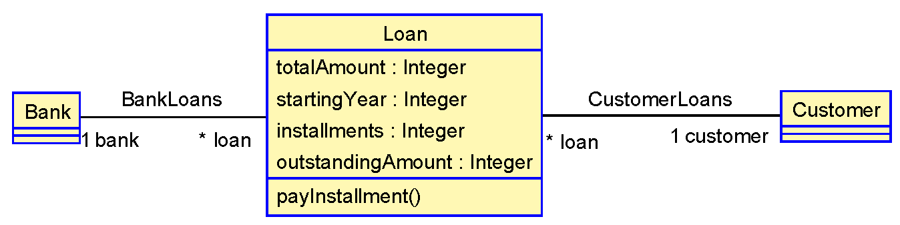
</p>


```
model loans
class Customer
end
class Bank
end
class Loan  
  attributes
    totalAmount : Integer
    startingYear : Integer
    installments : Integer
    outstandingAmount : Integer
  operations
    payInstallment()
end
association CustomerLoans between
    Customer [1]
    Loan [*] 
end
association BankLoans between 
    Bank [1]
    Loan [*]
end
constraints
context Customer inv OnlyOneLoan12Installments:
    self.loan->select(installments>12)->size()<=1
context Bank inv ThirtyPercentLoans12Installments:
    (self.loan->select(installments>12)->size() * 100.0 / self.loan->size()) <= 30
context Customer inv DifferentYears:
    self.loan->forAll(l1,l2|l1<>l2 implies l1.startingYear<>l2.startingYear)
```


## School

<p align="center">

</p>


```
model School
class Person 
attributes
  firstName: String
  lastName: String
  age : Integer
end
class Student < Person
  attributes
  studentId:String
end
class Teacher < Person
  attributes
  salary: Real
end
class School 
  attributes
  name: String
  address: String
end
composition Enrollment between 
  School [1]
  Student [*]
end
composition Faculty between 
  School [1]
  Teacher [*]
end
association Tutorship between 
    Teacher [1] 
    Student [*]
end
```

## Books and copies

<p align="center">

</p>

```
model Books

class Book
  attributes
    title : String
    year : Integer
end

class Edition
  attributes
    publisher : String
    city : String
    editionYear : Integer
    ISBN : String
end

class BookCopy 
  attributes 
    SerialNumber : String
end 

class Person
end

association Ownership between 
  Person [0..1] role owner
  BookCopy [*] role ownedBook 
end

association Authorship between 
  Book [*] role authoredBook 
  Person [*] role author
end

association Editionship between 
    Book [1]
    Edition [*]
end

association Copies between 
    Edition [1]
    BookCopy [*]
end
```


## Snarks

<p align="center">

</p>

```
model Snarks

class Snark
end

association Pat between 
Snark [0..2] role pat 
Snark [*] 
end 

class Brred
  attributes
    fur:Boolean
end

class Snarkdo 
  attributes
    teet : Integer
end 

class Zumbat
end

association Rete between 
  Zumbat [0..1] role reter
  Snarkdo [*] role retal
end

association Axum between 
  Snark [*] role axumedSnark 
  Zumbat [*] 
end

association SnarkBrred between 
    Snark [1]
    Brred [*]
end

association SnarkdoHood between 
    Brred [1]
    Snarkdo [*]
end
```


## Car

<p align="center">

</p>


```
model Car
class Make
  attributes
    name:String
end
class Model
  attributes 
     name:String
end
class Car
  attributes numberPlate:String
end
class Engine
  attributes diameter:Real
end
class Wheel
  attributes diameter:Real
end
class Seat
  attributes size:Real
end
composition CarWheels between 
    Car [1]
    Wheel [4]
end
composition CarEngine between 
    Car [1]
    Engine [1]
end
composition CarSeat between 
    Car [1]
    Seat [*]
end
association MakeModel between
    Make [1] 
    Model [*]
end
association ModelCar between
    Model [1] 
    Car [*]
end
constraints
  context Model inv ModelUniqueNames: Model.allInstances->isUnique(name)
  context Make inv MakeUniqueNames:   Make.allInstances->isUnique(name)
  context Model inv SameSeatSizes:
        self.car.seat->collect(size)->asSet()->size()=1
  context Car inv SameWheelDiameter:
        self.wheel->collect(diameter)->asSet()->size()=1
```


## PurchaseOrders

<p align="center">

</p>

```
model nozamA
class Company
attributes name : String
end
class Customer
end 
class Product 
attributes price:Integer 
end 
class Unit 
attributes 
    serialNumber:String
    price:Integer derive: self.product.price
end 
class Order 
attributes 
    totalAmount:Integer 
derive:self.unit->collect(price)->sum()
end
aggregation Catalog between 
Company [1] 
Product [*]
end 
association ProductUnit between 
Product [1]
Unit [*]
end 
aggregation Stock between 
Company [0..1]
Unit [*]
end 
aggregation orderContent between
Order [0..1]
Unit [1..*]
end 
aggregation Orders between 
Customer [1]
Order [*]
end 

constraints 
context Unit inv InStockOrWithCustomer:
   self.company->size() + self.order->size() = 1
```


## Banks

<p align="center">

</p>


```
model Banks
enum Gender {male, female, other}
class Person 
attributes
  age:Integer
  name:String
  gender:Gender
end
class Bank
end
class Branch
end
composition BankBranches between 
Bank [1]
Branch [*]
end
class Manager
  attributes
    salary:Integer
end
class Client
end
composition Management between 
  Branch [1]
  Manager [1]
end
composition Clientship between 
  Branch [1]
  Client [*]
end
association ManagerRole between
  Manager [0..1] role manager
  Person [1] role roleFiller
end
association ClientRole between
  Client [0..1] role client
  Person [1] role roleFiller
end
constraints
  context Person inv ManagerOrClient:
self.manager->notEmpty() implies 
    	   self.client.branch->excludes(self.manager.branch)
```

## LB1

<p align="center">
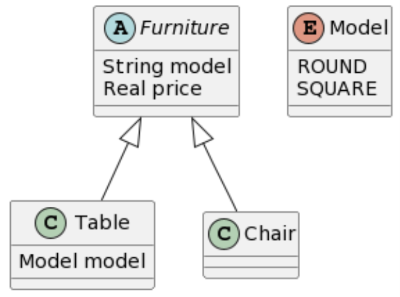
</p>

```
@startuml
abstract class Furniture {
  String model
  Real price
}
class Table {
  Model model
}
class Chair {
}
enum Model {
  ROUND
  SQUARE
} 
Furniture <|-- Table
Furniture <|-- Chair
@enduml

```

## LB2
<p align="center">

</p>

```
@startuml
@enduml

```

## LB3
<p align="center">

</p>

```
@startuml
@enduml

```
## LB4
<p align="center">

</p>

```
@startuml
@enduml

```
## LB5
<p align="center">

</p>

```
@startuml
@enduml

```
## LB6
<p align="center">
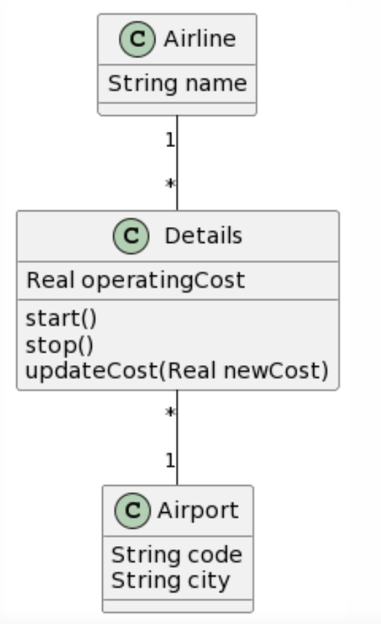
</p>

```
@startuml
@enduml

```
## LB7
<p align="center">
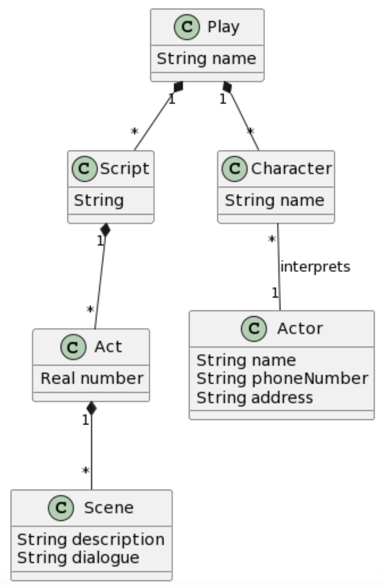
</p>

```
@startuml
@enduml

```
## LB8
<p align="center">
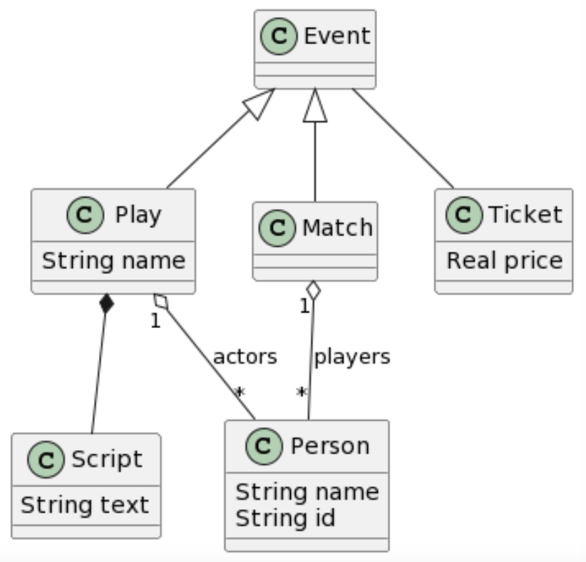
</p>

```
@startuml
@enduml

```
## LB9
<p align="center">

</p>

```
@startuml
@enduml

```
## LB10
<p align="center">

</p>

```
@startuml
@enduml

```

## JC1

<p align="center">

</p>

```
@startuml
@enduml

```

## JC2
<p align="center">

</p>

```
@startuml
@enduml

```

## JC3
<p align="center">

</p>

```
@startuml
@enduml

```
## JC4
<p align="center">

</p>

```
@startuml
@enduml

```
## JC5
<p align="center">
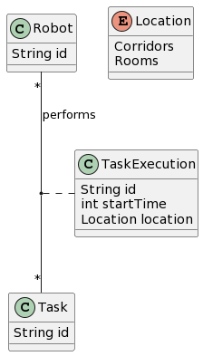
</p>

```
@startuml
@enduml

```
## JC6
<p align="center">
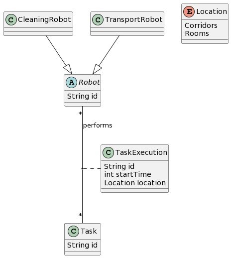
</p>

```
@startuml
@enduml

```
## JC7
<p align="center">
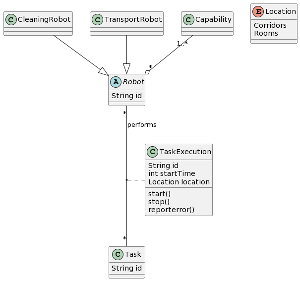
</p>

```
@startuml
@enduml

```
## JC8
<p align="center">
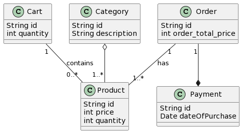
</p>

```
@startuml
@enduml

```
## JC9
<p align="center">

</p>

```
@startuml
@enduml

```
## JC10
<p align="center">
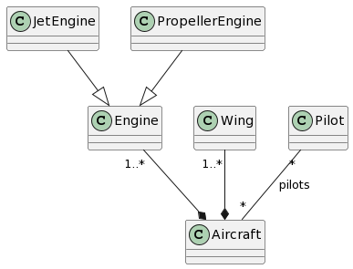
</p>

```
@startuml
@enduml

```

## JT1

<p align="center">

</p>

```
@startuml
@enduml

```

## JT2
<p align="center">

</p>

```
@startuml
@enduml

```

## JT3
<p align="center">
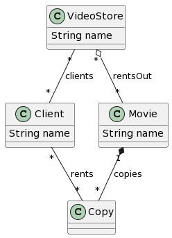
</p>

```
@startuml
@enduml

```
## JT4
<p align="center">

</p>

```
@startuml
@enduml

```
## JT5
<p align="center">
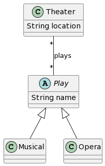
</p>

```
@startuml
@enduml

```
## JT6
<p align="center">
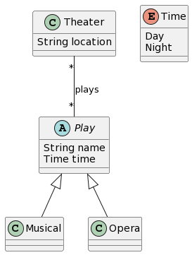
</p>

```
@startuml
@enduml

```
## JT7
<p align="center">
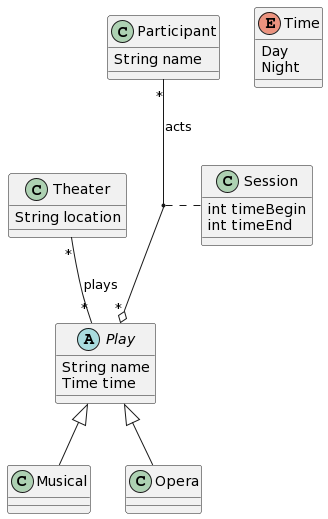
</p>

```
@startuml
@enduml

```
## JT8
<p align="center">
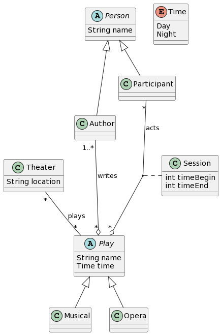
</p>

```
@startuml
@enduml

```
## JT9
<p align="center">

</p>

```
@startuml
@enduml

```
## JT10
<p align="center">
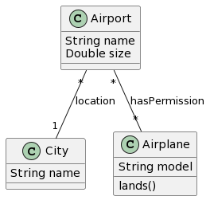
</p>

```
@startuml
@enduml

```